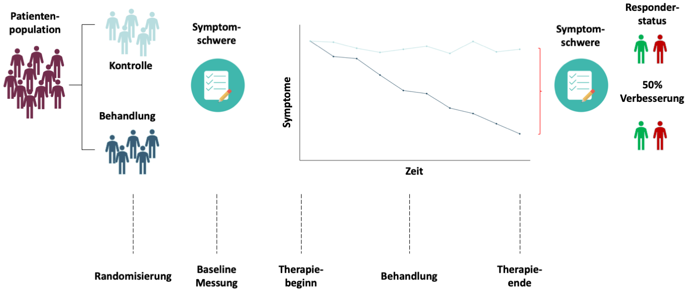

```{r setup, include=FALSE}
options(htmltools.dir.version = FALSE)

setwd("/Users/stephangoerigk/Desktop/Universität/Kongresse/DZP_Workshop_2022/DZP_Workshop_Slides/")

library(tidyverse)
library(kableExtra)
library(ggplot2)
library(plotly)
library(htmlwidgets)
library(MASS)
library(ggpubr)
library(xaringanthemer)
library(xaringanExtra)

style_duo_accent(
  primary_color = "#268188",
  secondary_color = "#00C1BF",
  background_image = "blank2.png"
)

xaringanExtra::use_xaringan_extra(c("tile_view"))

use_scribble(
  pen_color = "#00C1BF",
  pen_size = 4
  )

knitr::opts_chunk$set(
  fig.retina = TRUE,
  warning = FALSE,
  message = FALSE
)
```

name: Title slide
class: middle, left
<br><br><br><br><br><br><br>
# DZPG-Workshop - Methoden der Psychotherapieforschung

### Nachmittagssession - Innovative analysis of existing RCT data
##### 19.11.2022 | Dr. phil. Stephan Goerigk

---
class: top, left
name: Contact Slide

### Kontakt

.pull-left[
Dr. phil. Stephan Goerigk 

Psychologische Methodenlehre

Klinik für Psychiatrie und Psychotherapie

Ludwig-Maximilians-Universität

Nussbaumstraße 7 · 80336 München · 

[stephan.goerigk@med.uni-muenchen.de](mailto:stephan.goerigk@med.uni-muenchen.de)

[Publikationen](https://scholar.google.at/citations?user=nlvO-e4AAAAJ&hl=de)

[Commitment to Research Transparency](http://www.researchtransparency.org)
]

.pull-right[
.center[
<br><br><br>
.bottom[]
]
]

---
class: top, left
### Parallelgruppen-Design

#### Gold-Standard Wirksamkeitsanalyse (Efficacy)

.center[
```{r eval = TRUE, echo = F, out.width = "1000px"}

```
]

---
class: top, left
### Take-aways

.full-width[.content-box-gray[


]
]

[**Link zur Wissensüberprüfung**](https://docs.google.com/forms/d/e/1FAIpQLSfAAWpZWqxU4Bw5LzVFRtYo7RvCIt4BRAEWCHx6XvlePfEQzw/viewform?usp=sf_link)

