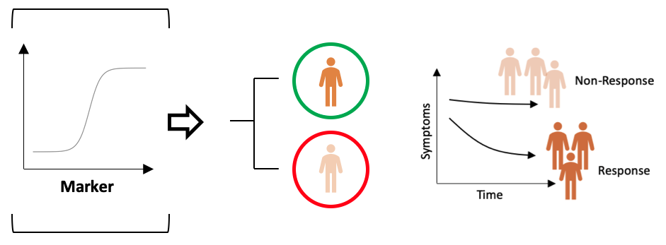
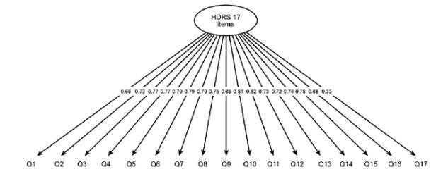
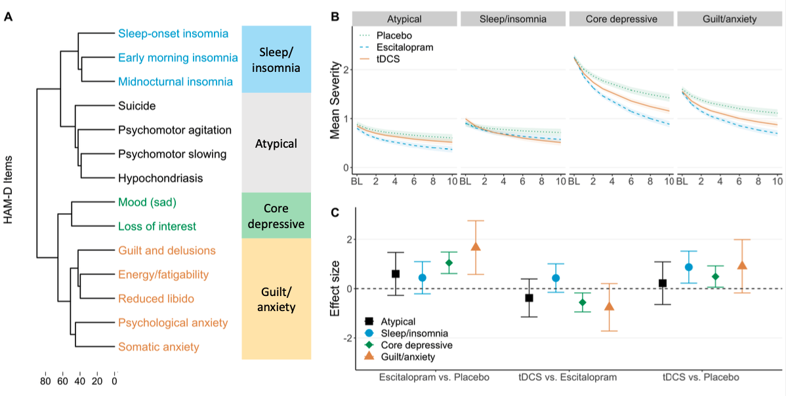
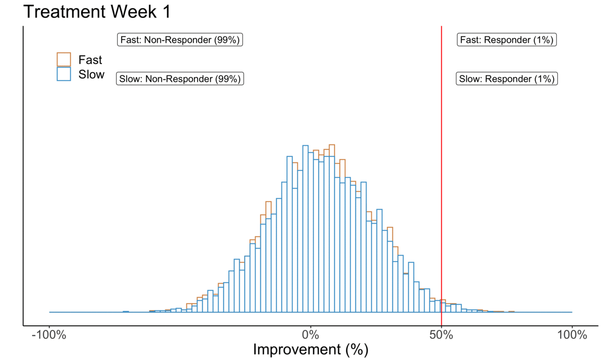
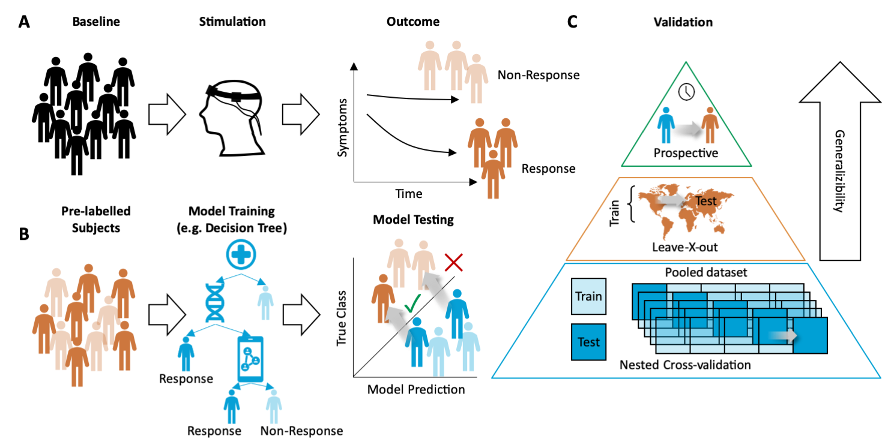

```{r setup, include=FALSE}
options(htmltools.dir.version = FALSE)

setwd("/Users/stephangoerigk/Desktop/Universität/Kongresse/DZP_Workshop_2022/DZP_Workshop_Slides/")

library(tidyverse)
library(kableExtra)
library(ggplot2)
library(plotly)
library(htmlwidgets)
library(MASS)
library(ggpubr)
library(xaringanthemer)
library(xaringanExtra)
library(lme4)
library(lmerTest)
library(lavaan)

style_duo_accent(
  primary_color = "#268188",
  secondary_color = "#00C1BF",
  background_image = "blank2.png"
)

xaringanExtra::use_xaringan_extra(c("tile_view"))

use_scribble(
  pen_color = "#00C1BF",
  pen_size = 4
  )

knitr::opts_chunk$set(
  fig.retina = TRUE,
  warning = FALSE,
  message = FALSE
)
```

name: Title slide
class: middle, left
<br><br><br><br><br><br><br>
# DZPG-Workshop - Methoden der Psychotherapieforschung

### Nachmittagssession - Innovative analysis of existing RCT data
##### 19.11.2022 | Dr. phil. Stephan Goerigk

---
class: top, left
name: Contact Slide

### Kontakt

.pull-left[
Dr. phil. Stephan Goerigk 

Psychologische Methodenlehre

Klinik für Psychiatrie und Psychotherapie

Ludwig-Maximilians-Universität

Nussbaumstraße 7 · 80336 München · 

[stephan.goerigk@med.uni-muenchen.de](mailto:stephan.goerigk@med.uni-muenchen.de)

[Publikationen](https://scholar.google.at/citations?user=nlvO-e4AAAAJ&hl=de)

[Commitment to Research Transparency](http://www.researchtransparency.org)
]

.pull-right[
.center[
<br><br><br>
.bottom[]
]
]

---
class: top, left
### Parallelgruppen-Design

#### Gold-Standard Wirksamkeitsanalyse (Efficacy)

.center[
```{r eval = TRUE, echo = F, out.width = "1000px"}
knitr::include_graphics("bilder/RCT.png")
```
]

---
class: top, left
### Parallelgruppen-Design

#### Gold-Standard Wirksamkeitsanalyse (Efficacy)

```{r include=FALSE}
n = 150 # number of individuals
t = 1:10   # number of time periods

df = expand.grid(t = 1:max(t),
                 id = 1:n)
df$group = c(rep("active", nrow(df)/2), rep("placebo", nrow(df)/2))

trajectory = c("Linear response",
               "Deteriorate",
               "Rev. U-shape",
               "Rapid response",
               "No change")

set.seed(123)
for(ch in unique(df$id)){

  if(df$group[df$id == ch][1] == "active"){
    df$trajectory[df$id == ch] = rep(sample(trajectory, size = 1, replace = T, prob = c(.5, .05, .2, .2, .05)), max(t))
  }
  if(df$group[df$id == ch][1] == "placebo"){
    df$trajectory[df$id == ch] = rep(sample(trajectory, size = 1, replace = T, prob = c(.2, .2, .1, .05, .45)), max(t))
  }

  if(df$trajectory[df$id == ch][1] == "No change"){
    df$y[df$id == ch] = 24 + 0*t  + rnorm(nrow(df[df$id == ch,]), 0, 3)
  }
  if(df$trajectory[df$id == ch][1] == "Rev. U-shape"){
    df$y[df$id == ch] = 24 + 8*t - 0.9*t^2 + rnorm(nrow(df[df$id == ch,]), 0, 3)
  }
  if(df$trajectory[df$id == ch][1] == "Linear response"){
    df$y[df$id == ch] = 24 - 1*t  + rnorm(nrow(df[df$id == ch,]), 0, 3)
  }
  if(df$trajectory[df$id == ch][1] == "Deteriorate"){
    df$y[df$id == ch] = 24 + 2*t  + rnorm(nrow(df[df$id == ch,]), 0, 3)
  }
  if(df$trajectory[df$id == ch][1] == "Rapid response"){
    df$y[df$id == ch] = 24 - 10 * log(t) +  rnorm(nrow(df[df$id == ch,]), 0, 3)
  }
}
```

.pull-left[
```{r echo=F, out.width = "400px"}
ggplot(data = df, aes(x = t, y = y, colour = group)) +
  stat_summary(geom = "line", fun = "mean") +
  stat_summary(geom = "point", fun = "mean") +
  scale_x_continuous(breaks = t) +
  coord_cartesian(ylim = c(0,30)) +
  labs(x = "Time", colour = "Group") +
  theme_classic() +
  theme(text = element_text(size = 25), legend.position = "bottom")
```
]

.pull-right[
```{r, eval=FALSE}
lmer(y ~ t * group + (1|id), data = df)
```

* Modellierung im linear mixed model (LMM)

* hierarchische Datenstruktur berücksichtigt (measurements nested within patients)

* Schätzung einer Durschnittsrate (Slope) für die Response der Gruppen

* Wirksamkeitsnachweis i.d.R. definiert durch Differenz in Gruppenslopes bis Endpunkt
(Zeit x Gruppe Interaktion)
]

---
class: top, left
### Parallelgruppen-Design

#### Gold-Standard Wirksamkeitsanalyse (Efficacy)

```{r, eval=FALSE}
lmer(y ~ t * group + (1|id), data = df)
```

```{r echo=FALSE}
round(summary(lmer(y ~ t * group + (1|id), data = df))$coefficients, 3)
```

* signifikante Überlegenheit der aktiven gegenüber Placebogruppe

* ABER: nur auf Gruppenebene (nicht alle Patienten zeigen ein Theraieansprechen)

**Vorsicht bei der Interpretation:**

* i.d.R. heterogene Therapieresponse

$\rightarrow$ Aufschlüsselung der Heterogenität Zielsetzung des **Präzisionsansatzes**

---
class: top, left
### Parallelgruppen-Design 

#### Präzisionsmedizinische Fragestellung

.center[
```{r eval = TRUE, echo = F, out.width = "1000px"}

```
]

---
class: top, left
### Responderanalyse 

#### Marker für Behandlungserfolg - Klassische Explanative Ansätze der Responderanalyse

.pull-left[
.center[
```{r eval = TRUE, echo = F, out.width = "400px"}

```
]

.center[
```{r eval = TRUE, echo = F, out.width = "400px"}
knitr::include_graphics("bilder/Moderation.png")
```
]
]

.pull-right[

**Ansatz: **

* assoziative Responderanalyse

* hohe Zahl von Moderationskandidaten unterschiedlicher Modalitäten (Verhalten, Biomarker...)

**ABER:**

* bislang wenig Anhaltpunkte für stratifizierte Behandlungsplanung

* wenig Replikation von Ergebnissen
]

.center[
```{r, eval=FALSE}
lmer(y ~ t * group * moderator + (1|id), data = df)
glm(response ~ group * moderator, data = df, family = binomial)
```
]

---
class: top, left
### Responderanalyse 

#### Marker für Behandlungserfolg - Ansätze zur Erhöhung der Präzision

.pull-left[
.center[
```{r eval = TRUE, echo = F, out.width = "500px"}

```
]
.center[
```{r eval = TRUE, echo = F, out.width = "500px"}
knitr::include_graphics("bilder/mod2.png")
```
]
]

.pull-right[
**Optimierung der Prädiktion:**
* Hinzunahme von Prädiktoren
* Bessere Messungen
* Leistungsfähigere Modelle
* Modellierung von Wechselwirkungen
* Non-lineare Modellierung
* Hierarchische Modellierung

**Optimierung der Outcomes:**
* Differenzierte (multidimensionale) Outcomes
* Dynamische Outcomes
* Hochauflösende Outcomes (Zeitreihen)
* Reziproke Outcomes (Wechselwirkungen)
* Vernetzte Outcomes
]

---
class: top, left
### Responderanalyse 

#### Probleme gängiger Outcomes von Wirksamkeitsstudien

* Summenwerte

* Arbitäre Cutoffs

* Keine Informationen über unterschiedliches Timing im Therapieansprechen

* Gruppenbasierte Durchschnittsverläufe

* oft zu geringe zeitliche Auflösung für schwankende Phänomene

* Keine objektiven Verhaltensmaße

* Wechselwirkungen auf Symptombasis nicht berücksichtigt

---
class: top, left
### Units of Analysis

#### Problem 1: Summenwerte

.pull-left[

.center[
```{r eval = TRUE, echo = F, out.width = "700px"}

```
]
.pull-left[
.center[
```{r eval = TRUE, echo = F, out.width = "200px"}
knitr::include_graphics("bilder/sum.png")
```
]
]
.pull-right[
.center[
<br>
```{r eval = TRUE, echo = F, out.width = "800px"}
knitr::include_graphics("bilder/gif1.gif")
```
]
]
]

.pull-right[
.center[
```{r eval = TRUE, echo = F, out.width = "400px"}
knitr::include_graphics("bilder/sideeffects.png")
```
]

* alle Symptome gehen gleichgewichtet ein (tau-Äquivalenz)

* Ignorieren behandlungsspezifischer Effekte
]

---
class: top, left
### Units of Analysis

#### Problem 1: Summenwerte

.pull-left[
.pull-left[
.center[
<br>
```{r eval = TRUE, echo = F, out.width = "200px"}
knitr::include_graphics("bilder/sum.png")
```
]
]
.pull-right[
.center[
<br><br>
```{r eval = TRUE, echo = F, out.width = "800px"}
knitr::include_graphics("bilder/gif1.gif")
```
]
]
]

.pull-right[
.center[
```{r eval = TRUE, echo = F, out.width = "400px"}

```
]
]

**Problem:**
* Symptome verbessern sich ggf. mit unterschiedlicher Intensität

* Schlecht ansprechende Symptome maskieren ggf. Verbesserung gut ansprechender Symptome
---
class: top, left
### Units of Analysis

#### Lösungsansatz: Symptomcluster

.pull-left[
.pull-left[
.center[
```{r eval = TRUE, echo = F, out.width = "200px"}
knitr::include_graphics("bilder/sum.png")
```
]
.center[
```{r eval = TRUE, echo = F, out.width = "200px"}
knitr::include_graphics("bilder/symptomcluster1.png")
```
]
]
.pull-right[
.center[
<br>
```{r eval = TRUE, echo = F, out.width = "800px"}
knitr::include_graphics("bilder/gif1.gif")
```
]
.center[
<br><br>
```{r eval = TRUE, echo = F, out.width = "800px"}
knitr::include_graphics("bilder/gif2.gif")
```
]
]
]

.pull-right[
.center[
```{r eval = TRUE, echo = F, out.width = "400px"}
knitr::include_graphics("bilder/symptomcluster.png")
```
]
.center[
```{r eval = TRUE, echo = F, out.width = "400px"}
knitr::include_graphics("bilder/symptomcluster3.png")
```
]
]

---
class: top, left
### Units of Analysis

#### Symptomcluster

```{r include=FALSE}

n = 10 # number of individuals
t = 1:10   # number of time periods

hama_names = c("Anxious Mood",
               "Tension",
               "Fears",
               "Insomnia",
               "Concentration and Memory",
               "Depressed Mood",
               "General somatic symptoms: muscular",
               "General somatic symptoms: sensory",
               "Cardiovascular symptoms",
               "Respiratory symptoms",
               "Gastro-intestinal symptoms",
               "Genito-urinary symptoms",
               "Other autonomic symptoms")

hama_means = c(2.9669421,
               2.8044077,
               2.4559229,
               2.4297521,
               1.3815427,
               1.3071625,
               1.6129477,
               1.5633609,
               1.4531680,
               1.0330579,
               1.7190083,
               0.6694215,
               1.6198347)

hama_sds = c(0.7136179,
             0.8339568,
             1.1314254,
             1.2283532,
             1.2313786,
             1.2454069,
             1.2715661,
             1.2264810,
             1.2583008,
             1.2200659,
             1.2815280,
             1.0691029,
             1.1585213)

hama_cor = read.csv("https://raw.githubusercontent.com/stephangoerigk/DZP_Workshop_Slides/master/hamacor.csv")
hama_cor = as.matrix(hama_cor[,-1])

data_cluster = round(
  faux::rnorm_multi(n = n,
                    mu = hama_means,
                    sd = hama_sds,
                    r = hama_cor,
                    varnames = hama_names,
                    empirical = F), 2)

data_cluster = data_cluster[,1:10]
names(data_cluster) = paste0("Item", 1:10)
```

Beispieldatensatz:

```{r}
head(data_cluster, 2)
```

Beispielcode:

```{r eval=F}
# Transpose data
data_transposed = t(na.omit(data_cluster))
# Compute distance matrix
d = dist(data_transposed, method = "euclidean")
# Clustering
clust = hclust(d, method = "ward.D2")
# Create dendrogram
dend <- as.dendrogram(clust, hang = -1)
# Prune dendrogram
pruned = dynamicTreeCut::cutreeDynamic(clust, distM = as.matrix(d), method = "hybrid", minClusterSize = 1)
```
---
class: top, left
### Units of Analysis

#### Symptomcluster: Beispielstudie (Goerigk et al., 2021)

.center[
```{r eval = TRUE, echo = F, out.width = "950px"}

```
]

---
class: top, left
### Units of Analysis

#### Problem 2: Arbitäre Cutoffs

.pull-left[
.center[
```{r eval = TRUE, echo = F, out.width = "450px"}
knitr::include_graphics("bilder/gif1.gif")
```
]
]
.pull-right[
.center[
```{r eval = TRUE, echo = F, out.width = "700px"}
knitr::include_graphics("bilder/respgif.gif")
```
]
]

* feste Definitionen für Behandlungserfolg z.B. Response $\geq$ 50% Symptomreduktion

* Vorteil: ermöglicht leicht interpretierbare Subgruppenanalyse (Responder vs. Non-Responder)

---
class: top, left
### Units of Analysis

#### Problem 2: Arbitäre Cutoffs

.pull-left[
.center[
```{r eval = TRUE, echo = F, out.width = "700px"}
knitr::include_graphics("bilder/respgif.gif")
```
]
]
.pull-right[
.center[
```{r eval = TRUE, echo = F, out.width = "300px"}
knitr::include_graphics("bilder/resp.png")
```
]
]

* Nachteil: Cutoff ist arbiträr $\rightarrow$ $\geq$ 50% Symptomreduktion klinisch relevant?

* Nachteil: 49% Verbessung und 50% Verbessung unterschiedliche Kategorie; 50% und 99% gleich

---
class: top, left
### Units of Analysis

#### Problem 3: Keine Informationen über unterschiedliches Timing im Therapieansprechen

.pull-left[
.center[
```{r eval = TRUE, echo = F, out.width = "700px"}
knitr::include_graphics("bilder/RCT2.png")
```
]
]
.pull-right[
.center[
```{r eval = TRUE, echo = F, out.width = "700px"}

```
]
]

* Wirksamkeitsvergleich und Berechnung von Responderstatus i.d.R. zum **Endpunkt** der Studie
* Ignorieren **frühen/späten** Therapieansprechens
* Keine Berücksichtigung der **Dynamik** von Subgruppen

---
class: top, left
### Units of Analysis

#### Lösungsansatz: Response-Trajektorien im Mixture Modell

.pull-left[
1-Trajektorien-Ansatz
.center[
```{r eval = TRUE, echo = F, out.width = "250px"}
knitr::include_graphics("bilder/gif4.gif")
```
]
Mixture-Modell
.center[
```{r eval = TRUE, echo = F, out.width = "250px"}

```
]
]

.pull-right[
Durchschnittstrajektorie
.center[
```{r eval = TRUE, echo = F, out.width = "250px"}
knitr::include_graphics("bilder/gif1.gif")
```
]
Durchschnittstrajektorie
.center[
```{r eval = TRUE, echo = F, out.width = "250px"}
knitr::include_graphics("bilder/gif3.gif")
```
]
]

---
class: top, left
### Units of Analysis

#### Lösungsansatz: Response-Trajektorien im Mixture Modell

```{r include=FALSE}
n = 30 # number of individuals
t = 1:3


df = expand.grid(t = 1:max(t),
                 id = 1:n)
df$group = c(rep("active", nrow(df)/2), rep("placebo", nrow(df)/2))

trajectory = c("Linear response",
               "Deteriorate",
               "Rev. U-shape",
               "Rapid response",
               "No change")

set.seed(123)
for(ch in unique(df$id)){

  if(df$group[df$id == ch][1] == "active"){
    df$trajectory[df$id == ch] = rep(sample(trajectory, size = 1, replace = T, prob = c(.5, .05, .2, .2, .05)), max(t))
  }
  if(df$group[df$id == ch][1] == "placebo"){
    df$trajectory[df$id == ch] = rep(sample(trajectory, size = 1, replace = T, prob = c(.2, .2, .1, .05, .45)), max(t))
  }

  if(df$trajectory[df$id == ch][1] == "No change"){
    df$y[df$id == ch] = 24 + 0*t  + rnorm(nrow(df[df$id == ch,]), 0, 3)
  }
  if(df$trajectory[df$id == ch][1] == "Rev. U-shape"){
    df$y[df$id == ch] = 24 + 8*t - 0.9*t^2 + rnorm(nrow(df[df$id == ch,]), 0, 3)
  }
  if(df$trajectory[df$id == ch][1] == "Linear response"){
    df$y[df$id == ch] = 24 - 1*t  + rnorm(nrow(df[df$id == ch,]), 0, 3)
  }
  if(df$trajectory[df$id == ch][1] == "Deteriorate"){
    df$y[df$id == ch] = 24 + 2*t  + rnorm(nrow(df[df$id == ch,]), 0, 3)
  }
  if(df$trajectory[df$id == ch][1] == "Rapid response"){
    df$y[df$id == ch] = 24 - 10 * log(t) +  rnorm(nrow(df[df$id == ch,]), 0, 3)
  }
}

df = df[, c("t", "id", "y")]
```

.pull-left[
Beispieldatensatz:

```{r}
head(df, 10)
```
]

.pull-left[
Beispielcode:

```{r eval=F}
mi = lcmm::hlme(fixed = y ~ 1 + t + I(t^2),
           mixture = ~ 1 + t + I(t^2),
           random = ~ 1,
           ng = 5,
           nwg = FALSE,
           idiag = FALSE,
           data = df,
           subject = "id")
```
]

---
class: top, left
### Units of Analysis

#### Response-Trajektorien: Beispielstudie (Goerigk et al. in prep)

.center[
```{r eval = TRUE, echo = F, out.width = "1000px"}

```
]

---
class: top, left
### Units of Analysis

#### Problem 5: Niedrige zeitliche Auflösung bei schwankenden Konstrukten

.pull-left[

* Endpunkt-Messung stark Timing-abhängig

* Besondere Bedeutung bei BL-Prädiktoren

* Zeitfenster vs. Zeitpunkt

**Fortschritt:**

* EMA-Daten und Sensing ermöglichen zeitlich-verdichtete Messungen

* Probleme: 

  * große Datenmengen
  * wenig inferenzstatistische Konzepte
  * Power-Überlegungen

]
.pull-right[
.center[
```{r echo = F, out.width = "400px"}
x <- seq(1, 24, 0.01)
z <- sin(x)

data.frame(x = x, 
           z = z) %>%
    pivot_longer(-x) %>%
    ggplot(aes(x, value)) +
    geom_line() +
  theme_classic() +
  geom_hline(yintercept = 0, linetype = "dashed") +
  labs(y = "Stimmung", x = "Zeit") +
  theme(text = element_text(size = 25))
```
]
]

---
class: top, left
### Units of Analysis

#### Lösungsansatz: Time-Series Modeling - Dynamic Time Warping

.pull-left[
.center[
```{r eval = TRUE, echo = F, out.width = "500px"}
knitr::include_graphics("bilder/dtw1.png")
```
]
]

.pull-right[
.center[
```{r eval = TRUE, echo = F, out.width = "500px"}
knitr::include_graphics("bilder/dtw2.png")
```
]
]

---
class: top, left
### Units of Analysis

#### Time-Series Modeling - Dynamic Time Warping

**Vorteile:**

* Time-series clustering Ansatz

* Reduktion der Komplexität hoch-aufgelöster Zeitreihendaten

* Zeitreihen können gruppiert werden, selbst wenn diese nicht in Form und Muster synchron sind (lagged)

* Flexibel modifizierbar, je nach gewünschtem Clustering Algorithmus (Hierachical, Centroid-based...)

---
class: top, left
### Units of Analysis

#### Time-Series Modeling - Dynamic Time Warping

```{r include=FALSE}
nodep <- 5
dep <- 20

# no depressive episode
ts_sim_nodep <- abs(arima.sim(n = 420, mean = 0.001, model = list(order = c(1,0,0), ar = 0.9))) + nodep

ts.plot(ts_sim_nodep, xlab = "Time", ylab = "Negative Mood", main = "Example no depressive episode", ylim=c(0,25))

# depressive episode
ts_sim_part1 <- abs(arima.sim(n = 210, model = list(order = c(1,0,0), ar = 0.9))) + nodep
ts_sim_part2 <- ts(arima.sim(n = 210, model = list(order = c(1,0,0), ar = 0.9)) + dep, start = 211,end =420)

ts_sim_dep <- ts.union(ts_sim_part1,ts_sim_part2)
ts_sim_dep<- pmin(ts_sim_dep[,1], ts_sim_dep[,2], na.rm = TRUE)

ts.plot(ts_sim_dep, xlab = "Time", ylab = "Negative Mood", main = "Example depressive episode", ylim=c(0,25))

ts_sim_boot_classic <- ts_sim_nodep %>%
  tseries::tsbootstrap(., nb=5, b=200, type = "block") %>%
  as.data.frame(.) %>%
  dplyr::rename_all(funs(c(paste0("nodep_",.))))

ts_sim_boot_dep <- ts_sim_dep %>%
  tseries::tsbootstrap(., nb=5, b=350, type = "block") %>%
  as.data.frame(.) %>%
  dplyr::rename_all(funs(c(paste0("dep_",.))))

ts_sim_df <- cbind(ts_sim_boot_classic,ts_sim_boot_dep)
```

Beispieldatensatz:

```{r}
head(ts_sim_df, 3)
```

Beispielcode:

```{r eval=F}
dtwclust::tsclust(t(ts_sim_df),
                  type = "h",
                  k = 2,
                  distance = "dtw",
                  control = hierarchical_control(method = "complete"),
                  preproc = NULL,
                  args = tsclust_args(dist = list(window.size = 5L)))
```

---
class: top, left
### Units of Analysis

#### Time-Series Modeling - Dynamic Time Warping

.center[
```{r eval = TRUE, echo = F, out.width = "900px"}

```
]

---
class: top, left
### Multivariate pattern

#### Strukturgleichungsmodelle:

.center[
```{r eval = TRUE, echo = F, out.width = "1000px"}

```
]

---
class: top, left
### Multivariate pattern

#### Strukturgleichungsmodelle:

.center[
```{r eval = TRUE, echo = F, out.width = "900px"}
knitr::include_graphics("bilder/semm.png")
```
]

---
class: top, left
### Multivariate pattern

#### Strukturgleichungsmodelle: Latent-Growth Curve

.center[
```{r eval = TRUE, echo = F, out.width = "500px"}
knitr::include_graphics("bilder/lgcm.png")
```
]

* Abbilden des Slopes als latente Variable (mit Varianz -> Random Effekt)

* Kann mit komplexen Messmodellen und multivariaten Analysen kombiniert werden

---
class: top, left
### Multivariate pattern

#### Strukturgleichungsmodelle: Latent-Growth Curve

.pull-left[
Beispieldatensatz:

```{r include=FALSE}
data = Demo.growth[,1:4]
data$t5 = data$t4
data = round(data, 2)
```

```{r message=FALSE, warning=FALSE}
library(lavaan)
head(data, 4)
```

Beispielcode:

```{r eval = F}
model <- ' i =~ 1*t1 + 1*t2 + 1*t3 + 1*t4 + 1*t5
           s =~ 0*t1 + 1*t2 + 2*t3 + 3*t4 + 4*t5'
fit <- lavaan::growth(model, data = data)
summary(fit)
```
]

.pull-right[
.center[
```{r eval = TRUE, echo = F, out.width = "500px"}
knitr::include_graphics("bilder/lgcm.png")
```
]
]
---
class: top, left
### Multivariate pattern

#### Strukturgleichungsmodelle: Latent-Growth Mediation

.center[
```{r eval = TRUE, echo = F, out.width = "500px"}

```
]

---
class: top, left
### Multivariate pattern

#### Strukturgleichungsmodelle: Latent-Growth Mediation

Beispielcode:

.pull-left[
```{r eval = F}
model <- '
iy =~ 1*y1 + 1*y2 + 1*y3 + 1*y4
sy =~ 0*y1 + 1*y2 + 2*y3 + 3*y4
ix =~ 1*x1 + 1*x2 + 1*x3 + 1*x4
sx =~ 0*x1 + 1*x2 + 2*x3 + 3*x4
im =~ 1*m1 + 1*m2 + 1*m3 + 1*m4
sm =~ 0*m1 + 1*m2 + 2*m3 + 3*m4

# direct effect
sy ~ c*sx
# mediator
sm ~ a*sx
sy ~ b*sm
# indirect effect (a*b)
ab := a*b
# total effect
total := c + (a*b)'
fit <- lavaan::sem(model, data = Data)
```
]
.pull-right[
.center[
```{r eval = TRUE, echo = F, out.width = "500px"}

```
]
]

---
class: top, left
### Multivariate pattern

#### Strukturgleichungsmodelle: Cross-lagged panel model

.center[
```{r eval = TRUE, echo = F, out.width = "700px"}

```
]

---
class: top, left
### Multivariate pattern

#### Strukturgleichungsmodelle: Cross-lagged panel model

Beispielcode:

.pull-left[
```{r eval=F}
cl_model = "
Cog_T4 ~ Cog_T3 + Func_T3
Func_T4 ~ Cog_T3 + Func_T3
Cog_T3 ~ Cog_T2 + Func_T2
Func_T3 ~ Cog_T2 + Func_T2
Cog_T2 ~ Cog_T1 + Func_T1
Func_T2 ~ Cog_T1 + Func_T1
Cog_T4 ~~ Func_T4
Cog_T3 ~~ Func_T3
Cog_T2 ~~ Func_T2
Cog_T1 ~~ Func_T1
"

fit <-lavaan::sem(cl_model, missing = "fiml", data = data)
summary(fit)
```
]
.pull-right[
.center[
```{r eval = TRUE, echo = F, out.width = "500px"}

```
]
]

---
class: top, left
### Multivariate pattern

#### Netzwerkanalyse

.center[
```{r eval = TRUE, echo = F, out.width = "1000px"}

```
]

* Analyse psychischer Phänomene auf dem Systemlevel

* Exploration hoch dimensionaler Daten ohne theoretische Vorannahmen (wie EFA, o.ä.)

* Besonderheit: paarweise Abhängigkeiten (pairwise conditional dependencies, PCD)

* PCD = probabilistisch abhängig konditional auf alle andere Variablen 

* joint probability distribution (graphical model - pairwise Markov random field, PMRF)

---
class: top, left
### Multivariate pattern

#### Netzwerkanalyse

.pull-left[
.center[
```{r eval = TRUE, echo = F, out.width = "500px"}
knitr::include_graphics("bilder/network1.png")
```
]
]

.pull-right[
* node selection: eher inhaltlich als methodisch

* edge selection methods (PMRF creation): 

  * fit indices
  * significance testing
  * cross-validation
  * regularized estimation (LASSO)
  
* node centrality:

  * node strength (sum of absolute edge weights of edges per node)
  * closeness (distance between the node and all other nodes)
  * betweenness (how often a node lies on the shortest path connecting two other nodes)
]
---
class: top, left
### Multivariate pattern

#### Netzwerkanalyse

.center[
```{r eval = TRUE, echo = F, out.width = "700px"}

```
]

---
class: top, left
### Multivariate pattern

#### Netzwerkanalyse

.center[
```{r eval = TRUE, echo = F, out.width = "500px"}

```
]

---
class: top, left
### Multivariate pattern

#### Netzwerkanalyse

**Beispielcode:**

```{r eval=F}
res <- mlVAR(data_detrended,
             vars=varLabs,
             idvar="id",
             dayvar="day",
             beepvar="beep",
             lags = 1,
             temporal = "orthogonal",
             contemporaneous = "orthogonal",
             nCores = 8)

# Get networks:
cont <- getNet(res, "contemporaneous", layout = "spring", nonsig = "hide", rule = "and")
bet  <- getNet(res, "between", nonsig = "hide", rule = "and")
temp <- getNet(res, "temporal", nonsig = "hide")
```


---
class: top, left
### Cross-validated prediction

#### Explanative vs. Prädiktive Perspektive

.pull-left[
.center[
```{r eval = TRUE, echo = F, out.width = "500px"}

```
]
]

.pull-right[
* Besprochene Outcomes lassen sich **prädizieren**

* Fortschritte durch komplexe Modellierungsmethoden (Machine Learning)

* Modelle erlauben Verarbeitung hochdimensionaler Daten (**Hyperparametertuning** erforderlich)

* Hoher **inkrementeller Nutzen** wegen Inkludierbarkeit in klinische Entscheidungsfindung

* Fortschritte in Interpretierbarkeit durch **IML** Methoden
]


---
class: top, left
### Cross-validated prediction

#### Explanative vs. Prädiktive Perspektive

.pull-left[
.center[
```{r eval = TRUE, echo = F, out.width = "250px"}

```
]
]
.pull-right[
**Explanative Analyse:**

* **Kriterium:** statistische Hypothesentests (p-Wert) und Effektstärken

* i.d.R. **gruppenbasierte** Durchschnittsschätzungen

* hoher **exploratorischer** Gehalt, i.d.R. leicht interpretierbare Modelle

**Prädiktive Analyse:**

* Vorhersage auf **Einzelpatientenebene**

* **Kriterium:** Vorhersagegenauigkeit

* **Notwendig:** Kreuzvalidierung anhand von Testdaten
]

---
class: top, left
### Cross-validated prediction

#### Use-Case und Relevanz der Kreuzvalidierung

.center[
```{r eval = TRUE, echo = F, out.width = "900px"}

```
]

---
class: top, left
### Cross-validated prediction

#### Beispielcode: Random-Forest Learner mit Repeated Nested CV

```{r eval=FALSE}
task_repCV = makeRegrTask(id = "task", target = "HAM-A", data = data)
ctrl = makeTuneControlRandom(maxit = 250L)

rf.parset = makeParamSet(
  makeIntegerParam("mtry", lower = 1L, upper = 10L),
  makeIntegerParam("ntree", lower = 100L, upper = 5000L),
  makeIntegerParam("nodesize", lower = 1L, upper = 10L))

rf = makeImputeWrapper(makeDummyFeaturesWrapper(makeLearner("regr.randomForest"))
                       
inner_RepCV = makeResampleDesc(method = "RepCV")
rdesc_RepCV = makeResampleDesc(method = "RepCV")

my_measures = list(rmse, spearmanrho)

rf_RepCV = makeTuneWrapper(rf, par.set = rf.parset, resampling = inner_RepCV, control = ctrl, measures = my_measures)

rinst_RepCV = makeResampleInstance(rdesc_RepCV, task_repCV)

res = resample(learner = rf_lso, task = task_repCV, resampling = rinst_RepCV, measures = my_measures)
```


---
class: top, left
### Take-aways

.full-width[.content-box-gray[
* RCTs sind essentielle Experimente zur Wirksamkeitsüberprüfung von Therapien und als solche nicht zu ersetzen

* Ziel von Re-Analysen: Aufschlüsseln von Heterogenität im Therapieansprechen (Tailored Treatments)

* Aus Wirksamkeitsanalysen abgeleitete Maße haben konzeptuelle Schwächen bzgl. Erklärung der Heterogenität 

* Analyse von Summenscores vs. separate Analyse von Symtptomsystemen

* Analyse von querschnittlicher Response/Remission vs. dynamische Verlaufsklassen  

* stationäre Messungen vs. Zeitreihen und Zeitreihenanalyse

* Störungsmodellierung als Schweregradseinschätzung/kategoriale Diagnose vs. auf dem Systemlevel (Netzwerke)

* Explanative Modellierung vs. Prädiktive Modellierung (oder Kombination)
]
]

[**Link zur Wissensüberprüfung**](https://docs.google.com/forms/d/e/1FAIpQLSfAAWpZWqxU4Bw5LzVFRtYo7RvCIt4BRAEWCHx6XvlePfEQzw/viewform?usp=sf_link)

