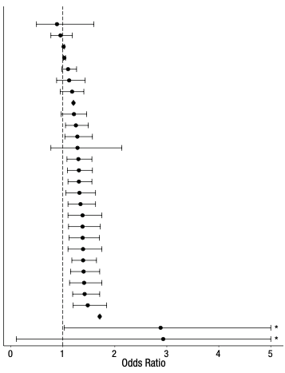
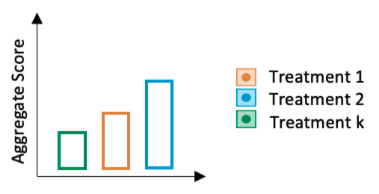

```{r setup, include=FALSE}
options(htmltools.dir.version = FALSE)

setwd("/Users/stephangoerigk/Desktop/Universität/Kongresse/DZP_Workshop_2022/DZP_Workshop_Slides/")

library(tidyverse)
library(kableExtra)
library(ggplot2)
library(plotly)
library(htmlwidgets)
library(MASS)
library(ggpubr)
library(xaringanthemer)
library(xaringanExtra)
library(lme4)
library(lmerTest)
library(lavaan)

style_duo_accent(
  primary_color = "#268188",
  secondary_color = "#00C1BF",
  background_image = "blank2.png"
)

xaringanExtra::use_xaringan_extra(c("tile_view"))

use_scribble(
  pen_color = "#00C1BF",
  pen_size = 4
  )

knitr::opts_chunk$set(
  fig.retina = TRUE,
  warning = FALSE,
  message = FALSE
)
```

name: Title slide
class: middle, left
<br><br><br><br><br><br><br>

## 1st Expert Workshop:
### Targeting Variability in Transcranial Stimulation Research

### Variability and Statistical Analysis
##### 07.10.2023 | Stephan Goerigk

---
class: top, left
name: Contact Slide

### Contact Details

.pull-left[
Stephan Goerigk 

Klinik für Psychiatrie und Psychotherapie

Ludwig-Maximilians-Universität

Nussbaumstraße 7 · 80336 München · 

[stephan.goerigk@med.uni-muenchen.de](mailto:stephan.goerigk@med.uni-muenchen.de)

[Commitment to Research Transparency](http://www.researchtransparency.org)
]

.pull-right[
.center[
<br><br><br>
.bottom[]
]
]

***
---
class: top, left
### Variability in Transcranial Stimulation Research

#### Variability and Statistical Analysis:

**1. Statistics causing variability (of results)**

  * Statistician degrees of freedom
  * Design aspects (e.g. selection of measures, trial design)

**2. Statistics to control variability**

  * Specific effects
  * Unspecific effects 

**3. Statistics to explain/understand variability**

  * Predictors (predictive [accuracy] vs. explanatory modeling [p-value, ES])
  * Outcomes (components, dynamics, interactions) 

---
class: top, left
### Statistics causing variability

.pull-left[

#### Statistician degrees of freedom

```{r eval = TRUE, echo = F, out.width = "350px"}

```
 
]
.pull-right[
.center[
```{r eval = TRUE, echo = F, out.width = "600px"}

```
]

<small>
* 29 teams analyzed same data to address the same question

* Estimated ES ranged from 0.89 to 2.93 in OR units

* 20 (69%) found significant effect, 9 teams (31%) did not 

* 21 unique combinations of covariates

**Significant variability in results of analyses of complex data difficult to avoid.**

**➔ Even by experts with honest intentions.**

***
Silberzahn et al. 2018
]

---
class: top, left
### Statistics causing variability

#### Statistician degrees of freedom

```{r echo=FALSE}
df = data.frame("No." = 1:11,
                "Type of degrees of freedom" = c(
                  "Choosing statistical models",
                  "Effect size computation (e.g. choice of SD)",
                  "Dealing with incomplete or missing data",
                  "Pre-processing of data (e.g., cleaning, normalization, smoothing, motion correction)" ,
                  "Dealing with violations of statistical assumptions",
                  "Dealing with outliers",
                  "Aggregation - discarding or combining levels of factors",
                  "Inclusion of covariates, independent variables, mediators, or moderators",
                  "Benchmarks for subject inclusion/exclusion in analyses",
                  "Estimation method, software package, computation of SEs",
                  "Inference criteria (e.g., Bayes factors, alpha level, sidedness of the test, corrections for multiple testing)"
))


names(df) = c("#", "Analyst degrees of freedom (Wicherts et al. 2016)")
df %>%
  kable("html") %>%
  kable_styling(font_size = 15, full_width = T)
```

---
class: top, left
### Statistics causing variability

#### Statistician degrees of freedom - Example: model selection in clinical efficacy analysis

.center[
```{r eval = TRUE, echo = F, out.width = "900px"}

```
]

---
class: top, left
### Statistics causing variability

#### Statistician degrees of freedom - Example: model selection in clinical efficacy analysis

.center[
```{r eval = TRUE, echo = F, out.width = "900px"}

```
]

---
class: top, left
### Statistics causing variability

#### Statistician degrees of freedom - Example: model selection in clinical efficacy analysis

.center[
```{r eval = TRUE, echo = F, out.width = "900px"}

```
]

---
class: top, left
### Statistics causing variability

#### Statistician degrees of freedom

```{r echo=FALSE}
df = data.frame("No." = 1:11,
                "Type of degrees of freedom" = c(
                  "Choosing statistical models",
                  "Effect size computation (e.g. choice of SD)",
                  "Dealing with incomplete or missing data",
                  "Pre-processing of data (e.g., cleaning, normalization, smoothing, motion correction)" ,
                  "Dealing with violations of statistical assumptions",
                  "Dealing with outliers",
                  "Aggregation - discarding or combining levels of factors",
                  "Inclusion of covariates, independent variables, mediators, or moderators",
                  "Benchmarks for subject inclusion/exclusion in analyses",
                  "Estimation method, software package, computation of SEs",
                  "Inference criteria (e.g., Bayes factors, alpha level, sidedness of the test, corrections for multiple testing)"
))

df$tip = c(
                  "Theory-guided or by nested model comparison",
                  "Raw SD or incorporate all random effects",
                  "Likelihood-based models (ML, REML, FIML), MI for cross-sectional, interpolation/kalman for TS",
                  "Situational; use established pipelines; preregister if possible" ,
                  "Robust inference if available; report limitations where relevant",
                  "Phys./biochem. readouts; Weibull dist. for non-normal",
                  "Theory-driven or in data-driven analyses when sparsity is a factor",
                  "A priori or based on quantitative modification indices",
                  "Stick to convention within field",
                  "Situational; bootstrap for unknown/unconventional distributions",
                  "Report power; adjust for multiple comparisons; differentiate confirmatory vs. exploratory; avoid inflation of p-values"
)

names(df) = c("#", "Analyst degrees of freedom (Wicherts et al. 2016)", "Heuristic recommendation")
df %>%
  kable("html") %>%
  kable_styling(font_size = 13, full_width = T)
```

---
class: top, left
### Statistics causing variability

#### Statistician degrees of freedom

**Problem:**

* No general "best-choice" consents

* Occasional recommendations based on simulation studies exist, but...

  * recommendations are highly situational
  * they rely on assumptions themselves
  * research-philosophic questions

*** 
.pull-left[

* Minimal consent:

  * Preregistration (analysis plan)
  * Open data
  * Open materials
]

.pull-right[
.center[
```{r eval = TRUE, echo = F, out.width = "600px"}

```
]
]

---
class: top, left
### Statistics to control variability

#### Specific vs. unspecific | fixed (covariate) vs. random effect

**Fixed effect (covariate):**

```{r, eval=FALSE}
lmer(y ~ t * group + center + (t|id), data = df)
```

* will compute average estimate and variability (and p-value) for each level of confounder
* Problematic with high number of dummy-coded levels (e.g. patients)

**Random effect:**

```{r, eval=FALSE}
lmer(y ~ t * group + (t|id/center), data = df)
```

* will only compute variability in model factor across levels of confounder

---
class: top, left
### Statistics to control variability

#### Unspecific variability - Hierarchical modeling

**What if variability is ignored? - Ecological interpretation error:**

.pull-left[
.center[
```{r eval = TRUE, echo = F, out.width = "400px"}

```
]
]

.pull-left[
Potential variability clusters in stimulation studies:

* Patients
* Clinicians
* Wards
* Centers
* Countries
* ...

Multilevel nesting is possible:

measurements in patients in centers

]

---
class: top, left
### Statistics to control variability

#### Unspecific variability - Hierarchical modeling

.center[
```{r eval = TRUE, echo = F, out.width = "880px"}

```
]

---
class: top, left
### Statistics to control variability

#### Unspecific variability - Hierarchical modeling

.center[
```{r eval = TRUE, echo = F, out.width = "880px"}

```
]

<!-- --- -->
<!-- class: top, left -->
<!-- ### Parallelgruppen-Design -->

<!-- #### Gold-Standard Wirksamkeitsanalyse (Efficacy) -->

<!-- ```{r eval=FALSE, include=FALSE} -->
<!-- n = 50 # number of individuals -->
<!-- t = 1:10   # number of time periods -->

<!-- df = expand.grid(t = 1:max(t), -->
<!--                  id = 1:n) -->
<!-- df$group = c(rep("active", nrow(df)/2), rep("placebo", nrow(df)/2)) -->

<!-- trajectory = c("Linear response", -->
<!--                "Deteriorate", -->
<!--                "Rev. U-shape", -->
<!--                "Rapid response", -->
<!--                "No change") -->

<!-- set.seed(123) -->
<!-- for(ch in unique(df$id)){ -->

<!--   if(df$group[df$id == ch][1] == "active"){ -->
<!--     df$trajectory[df$id == ch] = rep(sample(trajectory, size = 1, replace = T, prob = c(.5, .05, .2, .2, .05)), max(t)) -->
<!--   } -->
<!--   if(df$group[df$id == ch][1] == "placebo"){ -->
<!--     df$trajectory[df$id == ch] = rep(sample(trajectory, size = 1, replace = T, prob = c(.2, .2, .1, .05, .45)), max(t)) -->
<!--   } -->

<!--   if(df$trajectory[df$id == ch][1] == "No change"){ -->
<!--     df$y[df$id == ch] = 24 + 0*t  + rnorm(nrow(df[df$id == ch,]), 0, 3) -->
<!--   } -->
<!--   if(df$trajectory[df$id == ch][1] == "Rev. U-shape"){ -->
<!--     df$y[df$id == ch] = 24 + 8*t - 0.9*t^2 + rnorm(nrow(df[df$id == ch,]), 0, 3) -->
<!--   } -->
<!--   if(df$trajectory[df$id == ch][1] == "Linear response"){ -->
<!--     df$y[df$id == ch] = 24 - 1*t  + rnorm(nrow(df[df$id == ch,]), 0, 3) -->
<!--   } -->
<!--   if(df$trajectory[df$id == ch][1] == "Deteriorate"){ -->
<!--     df$y[df$id == ch] = 24 + 2*t  + rnorm(nrow(df[df$id == ch,]), 0, 3) -->
<!--   } -->
<!--   if(df$trajectory[df$id == ch][1] == "Rapid response"){ -->
<!--     df$y[df$id == ch] = 24 - 10 * log(t) +  rnorm(nrow(df[df$id == ch,]), 0, 3) -->
<!--   } -->
<!-- } -->
<!-- ``` -->

<!-- .pull-left[ -->
<!-- ```{r echo=F, out.width = "400px"} -->
<!-- png(file = "/Users/stephangoerigk/Desktop/Figure1.png", width = 6, height = 4, units = "in", res = 300) -->
<!-- ggplot(data = df, aes(x = t, y = y, colour = group)) + -->
<!--   stat_summary(geom = "line", aes(group = id), alpha = .1) + -->
<!--   stat_summary(geom = "line") + -->
<!--   stat_summary() + -->
<!--   scale_x_continuous(breaks = t) + -->
<!--   coord_cartesian(ylim = c(0,30)) + -->
<!--   labs(x = "Time", colour = "Group") + -->
<!--   theme_classic() + -->
<!--   theme(text = element_text(size = 25), legend.position = "none") -->
<!-- dev.off() -->

<!-- png(file = "/Users/stephangoerigk/Desktop/Figure2.png", width = 6, height = 4, units = "in", res = 300) -->
<!-- ggplot(data = df[df$t == 1 | df$t == 10,], aes(x = t, y = y, colour = group)) + -->
<!--   stat_summary(geom = "line", aes(group = id), alpha = .1) + -->
<!--   stat_summary(geom = "point", fun = "mean") + -->
<!--   geom_smooth(se = F, method = "lm") + -->
<!--   scale_x_continuous(breaks = t) + -->
<!--   coord_cartesian(ylim = c(0,30)) + -->
<!--   labs(x = "Time", colour = "Group") + -->
<!--   theme_classic() + -->
<!--   theme(text = element_text(size = 25), legend.position = "none") -->
<!-- dev.off() -->

<!-- png(file = "/Users/stephangoerigk/Desktop/Figure3.png", width = 6, height = 4, units = "in", res = 300) -->
<!-- ggplot(data = df, aes(x = t, y = y, colour = group)) + -->
<!--   stat_summary(geom = "point", aes(group = id), alpha = .2, size = .5) + -->
<!--   geom_segment(aes(x = 1, y = mean(df$y[df$t == 1 & df$group == "active"]), xend = 1, yend = mean(df$y[df$t == 1 & df$group == "placebo"])), colour = "black") + -->
<!--   geom_segment(aes(x = 2, y = mean(df$y[df$t == 2 & df$group == "active"]), xend = 2, yend = mean(df$y[df$t == 2 & df$group == "placebo"])), colour = "black") + -->
<!--   geom_segment(aes(x = 3, y = mean(df$y[df$t == 3 & df$group == "active"]), xend = 3, yend = mean(df$y[df$t == 3 & df$group == "placebo"])), colour = "black") + -->
<!--   geom_segment(aes(x = 4, y = mean(df$y[df$t == 4 & df$group == "active"]), xend = 4, yend = mean(df$y[df$t == 4 & df$group == "placebo"])), colour = "black") + -->
<!--   geom_segment(aes(x = 5, y = mean(df$y[df$t == 5 & df$group == "active"]), xend = 5, yend = mean(df$y[df$t == 5 & df$group == "placebo"])), colour = "black") + -->
<!--   geom_segment(aes(x = 6, y = mean(df$y[df$t == 6 & df$group == "active"]), xend = 6, yend = mean(df$y[df$t == 6 & df$group == "placebo"])), colour = "black") + -->
<!--   geom_segment(aes(x = 7, y = mean(df$y[df$t == 7 & df$group == "active"]), xend = 7, yend = mean(df$y[df$t == 7 & df$group == "placebo"])), colour = "black") + -->
<!--   geom_segment(aes(x = 8, y = mean(df$y[df$t == 8 & df$group == "active"]), xend = 8, yend = mean(df$y[df$t == 8 & df$group == "placebo"])), colour = "black") + -->
<!--   geom_segment(aes(x = 9, y = mean(df$y[df$t == 9 & df$group == "active"]), xend = 9, yend = mean(df$y[df$t == 9 & df$group == "placebo"])), colour = "black") + -->
<!--   geom_segment(aes(x = 10, y = mean(df$y[df$t == 10 & df$group == "active"]), xend = 10, yend = mean(df$y[df$t == 10 & df$group == "placebo"])), colour = "black") + -->
<!--   stat_summary(geom = "point", fun = "mean") + -->
<!--   scale_x_continuous(breaks = t) + -->
<!--   coord_cartesian(ylim = c(0,30)) + -->
<!--   labs(x = "Time", colour = "Group") + -->
<!--   theme_classic() + -->
<!--   theme(text = element_text(size = 25), legend.position = "none") -->
<!-- dev.off() -->

<!-- png(file = "/Users/stephangoerigk/Desktop/Figure4.png", width = 6, height = 4, units = "in", res = 300) -->
<!-- ggplot(data = df, aes(x = t, y = y, colour = group)) + -->
<!--     geom_smooth(se = F, method = "lm", aes(group = id), size = .1) + -->
<!--   stat_summary(geom = "point", fun = "mean") + -->
<!--   geom_smooth(se = F, method = "lm") + -->
<!--   scale_x_continuous(breaks = t) + -->
<!--   coord_cartesian(ylim = c(0,30)) + -->
<!--   labs(x = "Time", colour = "Group") + -->
<!--   theme_classic() + -->
<!--   theme(text = element_text(size = 25), legend.position = "none") -->
<!-- dev.off() -->

<!-- png(file = "/Users/stephangoerigk/Desktop/Figure5.png", width = 6, height = 4, units = "in", res = 300) -->
<!-- ggplot(data = df, aes(x = t, y = y, colour = group)) + -->
<!--     geom_smooth(se = F, method = "lm", aes(group = id), size = .1, formula = y ~ x + I(x^2)) + -->
<!--   stat_summary(geom = "point", fun = "mean") + -->
<!--   geom_smooth(se = F, method = "lm", formula = y ~ x + I(x^2)) + -->
<!--   scale_x_continuous(breaks = t) + -->
<!--   coord_cartesian(ylim = c(0,50)) + -->
<!--   labs(x = "Time", colour = "Group") + -->
<!--   theme_classic() + -->
<!--   theme(text = element_text(size = 25), legend.position = "none") -->
<!-- dev.off() -->
<!-- ``` -->
<!-- ] -->

<!-- .pull-right[ -->
<!-- ```{r, eval=FALSE} -->
<!-- lmer(y ~ t * group + (1|id), data = df) -->
<!-- ``` -->

<!-- * Modellierung im linear mixed model (LMM) -->

<!-- * hierarchische Datenstruktur berücksichtigt (measurements nested within patients) -->

<!-- * Schätzung einer Durschnittsrate (Slope) für die Response der Gruppen -->

<!-- * Wirksamkeitsnachweis i.d.R. definiert durch Differenz in Gruppenslopes bis Endpunkt -->
<!-- (Zeit x Gruppe Interaktion) -->
<!-- ] -->

---
class: top, left
### Statistics to explain/understand variability


.pull-left[
.center[
```{r eval = TRUE, echo = F, out.width = "500px"}
knitr::include_graphics("bilder/mod3.png")
```
]

.center[
```{r eval = TRUE, echo = F, out.width = "500px"}

```
]
]

.pull-right[


**Predictors and models:**
* Adding informative predictors
* High-performance (sparse) models
* Modeling interactions
* Non-linear modeling
* Hierarchical modeling

***

**Outcomes:**
* Multi-facetted outcomes
* Dynamic outcomes
* High-resolution outcomes (time-series)
* Reciprocal outcomes (interactions and feedback loops)
]

---
class: top, left
### Statistics to explain/understand variability

#### Clinical improvement - Within-outcome clusters

.pull-left[

.center[
```{r eval = TRUE, echo = F, out.width = "700px"}
knitr::include_graphics("bilder/dep1.png")
```
]
.pull-left[
.center[
```{r eval = TRUE, echo = F, out.width = "200px"}

```
]
]
.pull-right[
.center[
<br>
```{r eval = TRUE, echo = F, out.width = "800px"}
knitr::include_graphics("bilder/gif1.gif")
```
]
]
]

.pull-right[
.center[
```{r eval = TRUE, echo = F, out.width = "400px"}
knitr::include_graphics("bilder/sideeffects.png")
```
]

* Symptoms are equally weighed (𝝉-equivalent)

* Ignores symptom-specific effects.
]


---
class: top, left
### Statistics to explain/understand variability

#### Clinical improvement - Within-outcome clusters

.pull-left[
.pull-left[
.center[
```{r eval = TRUE, echo = F, out.width = "200px"}

```
]
.center[
```{r eval = TRUE, echo = F, out.width = "200px"}
knitr::include_graphics("bilder/symptomcluster1.png")
```
]
]
.pull-right[
.center[
<br>
```{r eval = TRUE, echo = F, out.width = "800px"}
knitr::include_graphics("bilder/gif1.gif")
```
]
.center[
<br><br>
```{r eval = TRUE, echo = F, out.width = "800px"}
knitr::include_graphics("bilder/gif2.gif")
```
]
]
]

.pull-right[
.center[
```{r eval = TRUE, echo = F, out.width = "400px"}

```
]
.center[
```{r eval = TRUE, echo = F, out.width = "400px"}

```
]
]

---
class: top, left
### Statistics to explain/understand variability

#### Clinical improvement - Within-outcome clusters (Goerigk et al., 2021)

.center[
```{r eval = TRUE, echo = F, out.width = "950px"}
knitr::include_graphics("bilder/Fig1.png")
```
]

---
class: top, left
### Statistics to explain/understand variability

#### Between-subject variability - Response Dynamics

.pull-left[
.center[
```{r eval = TRUE, echo = F, out.width = "700px"}

```
]
]
.pull-right[
.center[
```{r eval = TRUE, echo = F, out.width = "700px"}
knitr::include_graphics("bilder/Timing.gif")
```
]
]

* Calculation of responder status at **study endpoint** 
* Ignores **early/late** response
* Ignores individual **dynamics** of change

---
class: top, left
### Statistics to explain/understand variability

#### Between-subject variability - Response-Trajectories: 

.pull-left[
1-Trajectory-Approach
.center[
```{r eval = TRUE, echo = F, out.width = "250px"}

```
]
Mixture-Model
.center[
```{r eval = TRUE, echo = F, out.width = "250px"}
knitr::include_graphics("bilder/gif5.gif")
```
]
]

.pull-right[
Average Trajectory
.center[
```{r eval = TRUE, echo = F, out.width = "250px"}
knitr::include_graphics("bilder/gif1.gif")
```
]
Average Trajectory
.center[
```{r eval = TRUE, echo = F, out.width = "250px"}
knitr::include_graphics("bilder/gif3.gif")
```
]
]

---
class: top, left
### Statistics to explain/understand variability

#### Between-subject variability - Response-Trajectories: 

.center[
```{r eval = TRUE, echo = F, out.width = "800px"}

```
]

---
class: top, left
### Statistics to explain/understand variability

#### Between-subject variability - Response-Trajectories: 

.center[
```{r eval = TRUE, echo = F, out.width = "800px"}
knitr::include_graphics("bilder/traj2.png")
```
]

---
class: top, left
### Statistics to explain/understand variability

#### Within-subject variability: 

.pull-left[
.center[
```{r eval = TRUE, echo = F, out.width = "450px"}

```
]
]
.pull-right[
.center[
```{r eval = TRUE, echo = F, out.width = "450px"}

```
]
]


---
class: top, left
### Statistics to explain/understand variability

#### Within-subject variability: Time-Series Networks (Borsboom et al. 2021)

.center[
```{r eval = TRUE, echo = F, out.width = "700px"}

```
]

---
class: top, left
### Statistics to explain/understand variability

#### Within-subject variability: Time-Series Networks (Borsboom et al. 2021)

.center[
```{r eval = TRUE, echo = F, out.width = "900px"}

```
]


---
class: top, left
### Statistics to explain/understand variability

#### Within-subject variability: Systems perspective (Lunansky et al. 2023)

.center[
```{r eval = TRUE, echo = F, out.width = "670px"}
knitr::include_graphics("bilder/nw2.png")
```
]

---
class: top, left
### References

<small>
Borsboom, D., Deserno, M. K., Rhemtulla, M., Epskamp, S., Fried, E. I., McNally, R. J., ... & Waldorp, L. J. (2021). Network analysis of multivariate data in psychological science. Nature Reviews Methods Primers, 1(1), 58.

Goerigk, S. A., Padberg, F., Bühner, M., Sarubin, N., Kaster, T. S., Daskalakis, Z. J., ... & Brunoni, A. R. (2021). Distinct trajectories of response to prefrontal tDCS in major depression: results from a 3-arm randomized controlled trial. Neuropsychopharmacology, 46(4), 774-782.

Goerigk, S. A., Padberg, F., Chekroud, A., Kambeitz, J., Bühner, M., & Brunoni, A. R. (2021). Parsing the antidepressant effects of non-invasive brain stimulation and pharmacotherapy: A symptom clustering approach on ELECT-TDCS. Brain Stimulation, 14(4), 906-912.

Kaster, T. S., Downar, J., Vila-Rodriguez, F., Thorpe, K. E., Feffer, K., Noda, Y., ... & Blumberger, D. M. (2019). Trajectories of response to dorsolateral prefrontal rTMS in major depression: a THREE-D study. American Journal of Psychiatry, 176(5), 367-375.

Lunansky, G., van Borkulo, C. D., Blanken, T., Cramer, A., & Borsboom, D. (2022). Bouncing back from life’s perturbations: Formalizing psychological resilience from a complex systems perspective.

Silberzahn, R., Uhlmann, E. L., Martin, D. P., Anselmi, P., Aust, F., Awtrey, E., ... & Nosek, B. A. (2018). Many analysts, one data set: Making transparent how variations in analytic choices affect results. Advances in Methods and Practices in Psychological Science, 1(3), 337-356.

Wicherts, J. M., Veldkamp, C. L., Augusteijn, H. E., Bakker, M., Van Aert, R., & Van Assen, M. A. (2016). Degrees of freedom in planning, running, analyzing, and reporting psychological studies: A checklist to avoid p-hacking. Frontiers in psychology, 1832.


